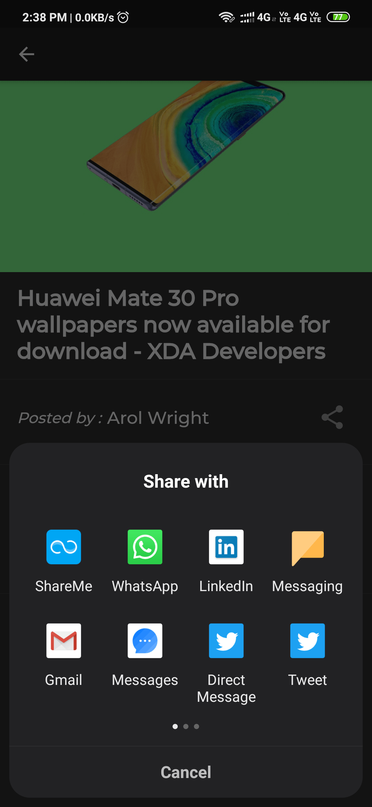

# News_Application

A new Flutter project.

## Getting Started

This project is a starting point for a Flutter application.

- Google Sing In.
- Internet Connctivity Checker.
- Share the News to Social Media.
- Trending and Allnews are separated by Tabs.
- User Can LogIn and LogOut.
- Swipe to Refresh.
- Can read full Article.
- Some cool Animations.

## Screenshots

      
